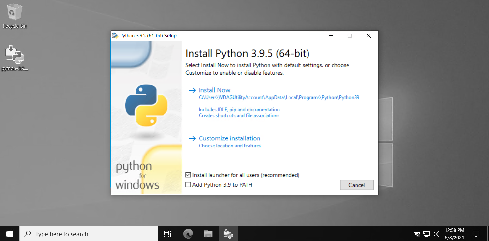
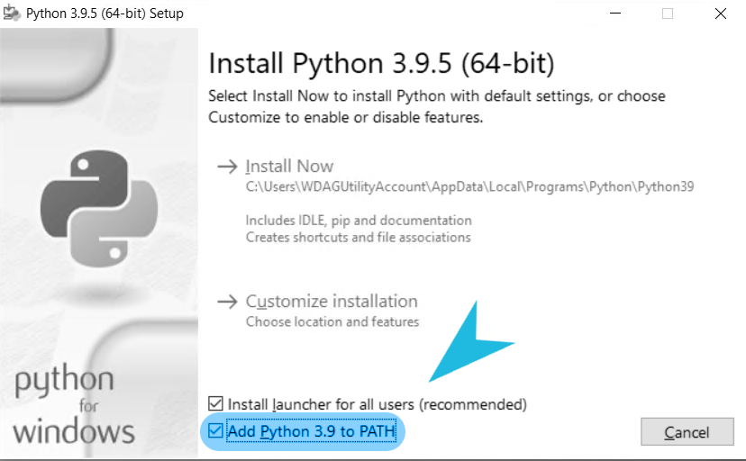
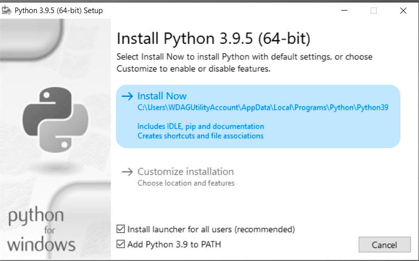
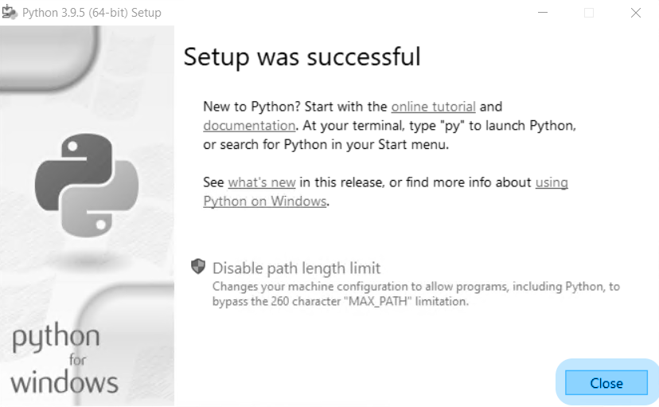
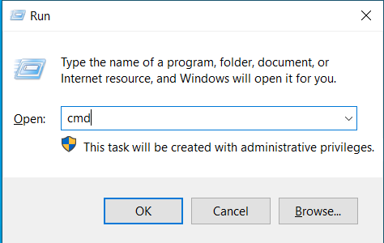
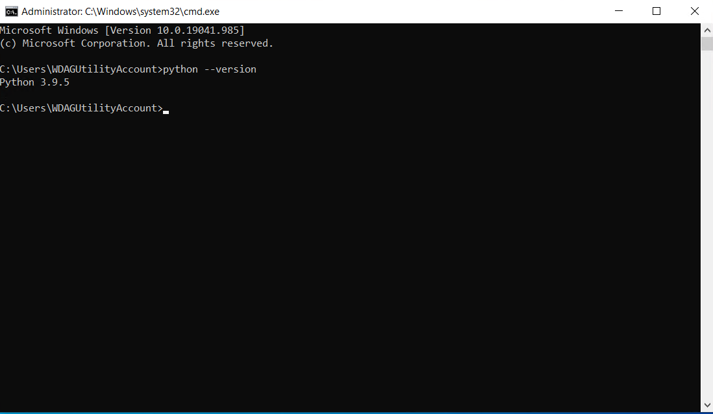
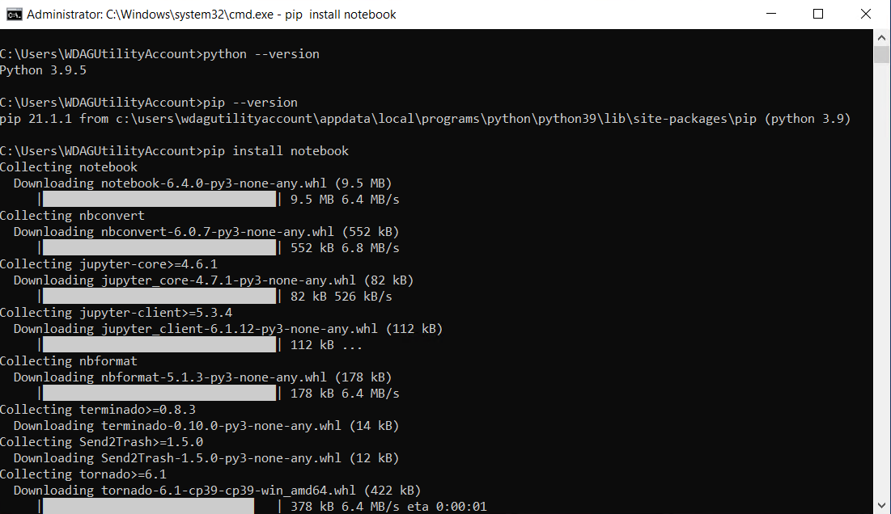
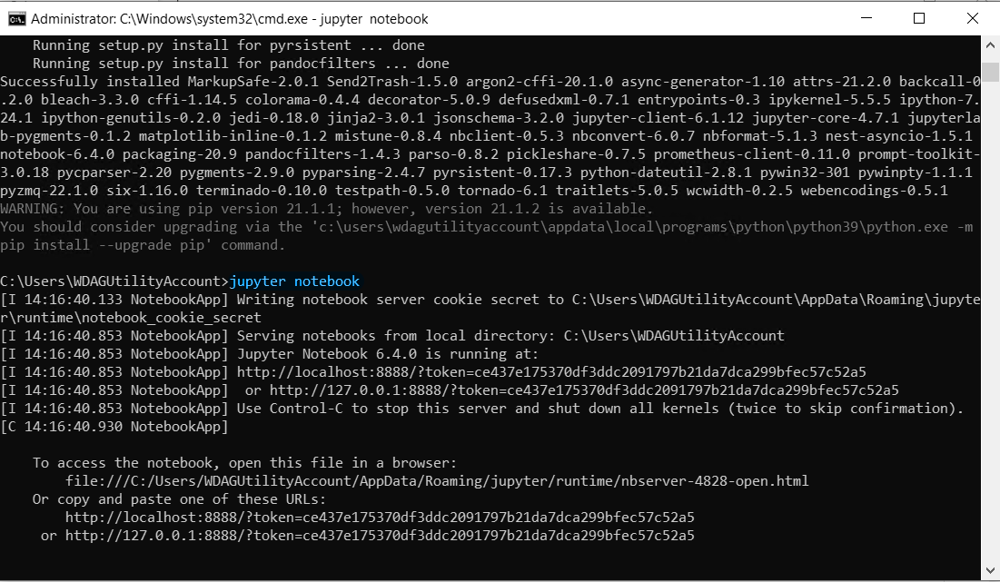
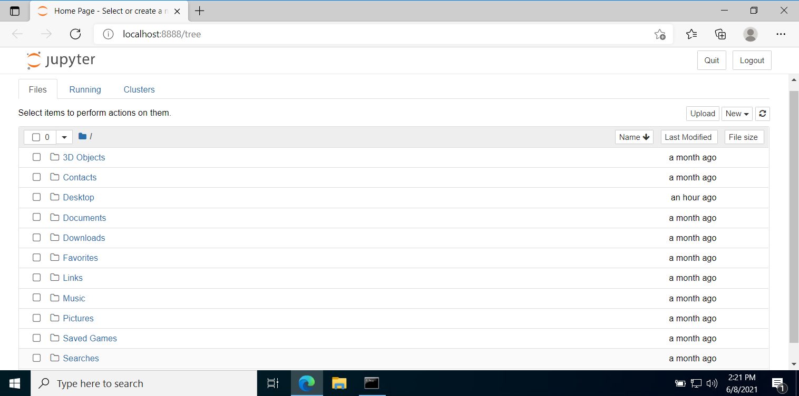
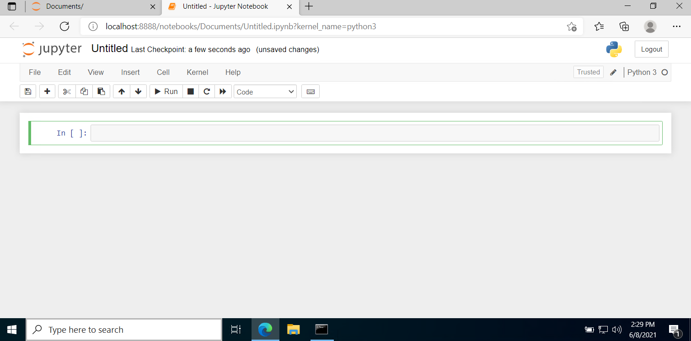

# Python workshop

Organized by The Nexus and SJCET Startup Bootcamp.

<table>
  <tr>
    <td>Speaker</td>
    <td>Topic</td>
  </tr>
  <tr>
    <td>Siddharth Prajosh</td>
    <td>Python</td>
  </tr>
</table>

Workshop pre-requisites:

- `python` (_version 3.8 or greater_)
- `Jupyter Notebook` (_python interactive developement web application_)

## Setting up python workspace

### Windows

<ul>
  <li>
    
Download the latest python ver. 3.9 from the official [website](https://www.python.org/downloads/)

     
    
  </li>
  <li>
    
     
    
Launch the executable setup file you just downloaded, and proceed through the installation

     
    
Make sure that the <i>Add Python 3.9 to PATH</i> option is checked

      
    
     
    
By clicking on the "<b><i>Install Now</i></b>" button initiate installation

     
    
     
    
Once the installation is completed, close the setup (You might have to restart your PC depending on the version of window and hardware specification)

     
    
  </li>
  <li>
    
Open windows command prompt by submitting the command "cmd" in the <b>Windows Run</b> dialog box To open Windows Run, use either: 

     
    <ul>
      <li><b>Windows Button + R</b> Keyboard shortcut</li>
      <li><b>Right-click Windows Button</b> and select <b>"Run"</b></li>
    </ul>
     
    
     
    
  </li>
  <li>
    
Within the windows Command Prompt, ensure the correct version of python is installed by running <code>python --version</code>

     
    
     
  </li>
  <li>
    
Python uses <b>pip</b> package manager which can be used to install various development software, which we will now use to install jupyter notebook

     
    
Use the command: <code>pip install notebook</code> to install jupyter notebook This will install jupyter notebook and all it's dependencies, wait for installation to complete.

     
    
     
  </li>
  <li>
    
After installation is complete, you can start a jupyter notebook webserver by simply running the command <code>jupyter notebook</code> within command prompt window

     
    
     
    
     
  </li>
  <li>
    
Navigate to an appropriate directory/folder and create a new notebook

     
    
  </li>
  <li>
    
     
    
<b><i>That's it, you're done setting up your system!</i></b>

  </li>
</ul>
