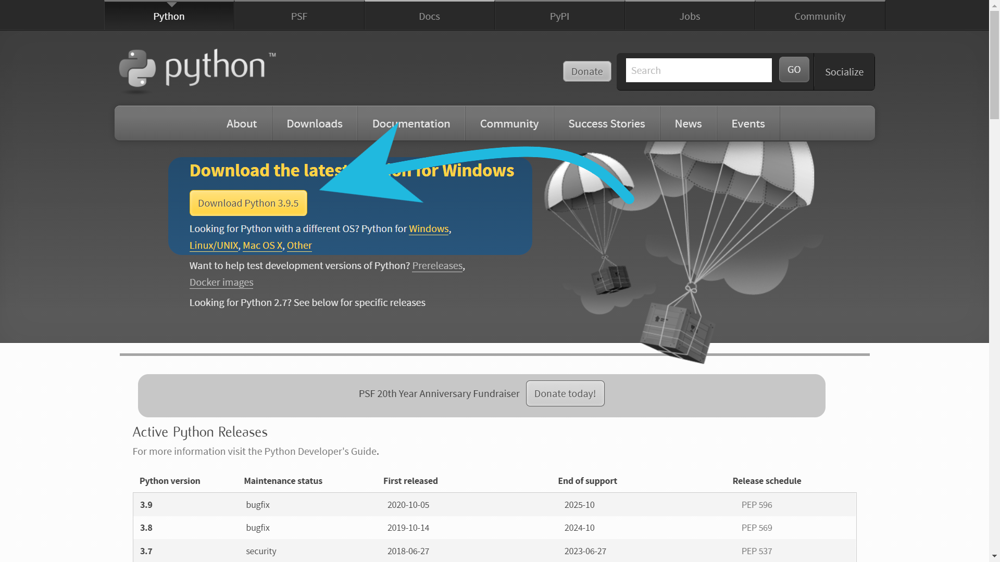

# Python workshop   

Organized by The Nexus and SJCET Startup Bootcamp. 

<table>
  <tr>
    <td>Speaker</td>
    <td>Topic</td>
  </tr>
  <tr>
    <td>Siddharth Prajosh</td>
    <td>Python</td>
  </tr>
</table>  

Workshop pre-requisites:  
* ```python``` (*version 3.8 or greater*) 
* ```Jupyter Notebook``` (*python interactive developement web application*) 

## Setting up python workspace 

* Download the latest python ver. 3.9 from the offial [website](https://www.python.org/downloads/)
    
