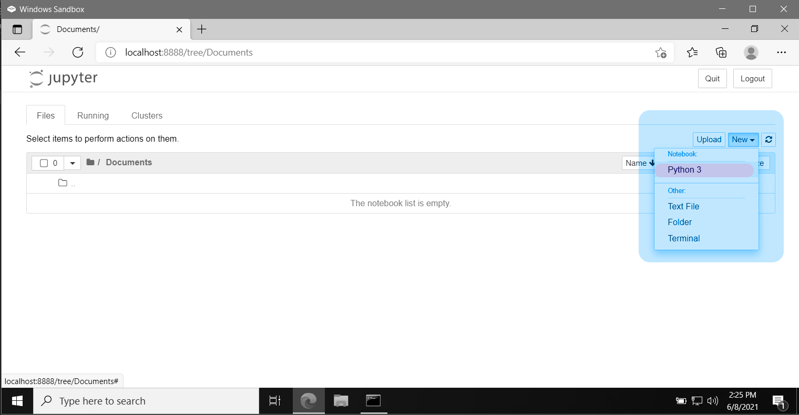

# Python workshop

Organized by The Nexus and SJCET Startup Bootcamp.

<table>
  <tr>
    <td>Speaker</td>
    <td>Topic</td>
  </tr>
  <tr>
    <td>Siddharth Prajosh</td>
    <td>Python</td>
  </tr>
</table>

Workshop pre-requisites:

- `python` (_version 3.8 or greater_)
- `Jupyter Notebook` (_python interactive developement web application_)

# Setting up python workspace

## Windows

### 1.0 Downloading latest python

Download the latest python ver. 3.9 from the official <a href="https://www.python.org/downloads/">website</a>

 
  

### 2.0 Setup  

Launch the executable setup file you just downloaded, and proceed through the installation

#### 2.1 Add path option checked

Make sure that the <i>Add Python 3.9 to PATH</i> option is checked

  

#### 2.2 Initiate 

By clicking on the "<b><i>Install Now</i></b>" button initiate installation

 

#### 2.3 Complete installation

Once the installation is completed, close the setup (You might have to restart your PC depending on the version of window and hardware specification)

 

### 3.0 Command prompt setup 

Open windows command prompt by submitting the command "cmd" in the <b>Windows Run</b> dialog box To open Windows Run, use either: 
  

* **Windows Button + R** Keyboard shortcut 
* **Right-click Windows Button** and select **"Run"**  

 

#### 3.1 Check python version

Within the windows Command Prompt, ensure the correct version of python is installed by running <code>python --version</code>

 

 

Python uses <b>pip</b> package manager which can be used to install various development software, which we will now use to install jupyter notebook

### 4.0 Install Jupyter Notebook

Use the command: <code>pip install notebook</code> to install jupyter notebook This will install jupyter notebook and all it's dependencies, wait for installation to complete.

 

 

### 5.0 Run Jupyter Notebook

After installation is complete, you can start a jupyter notebook webserver by simply running the command <code>jupyter notebook</code> within command prompt window

 

 

 

### 6.0 Creating new notebook for development

Navigate to an appropriate directory/folder and create a new notebook

 

 

 

### That's it, you're done setting up your system!

